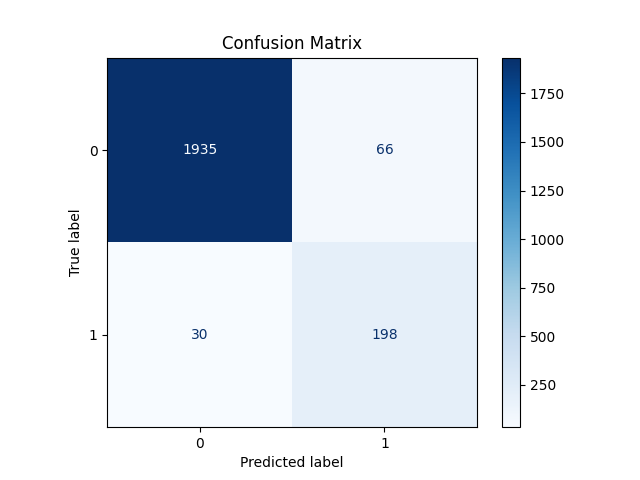
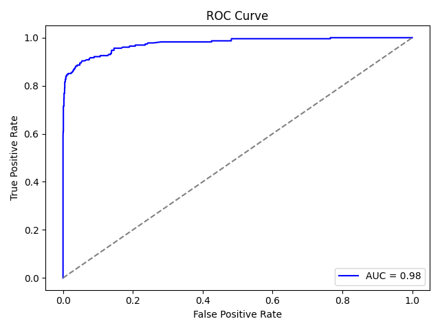
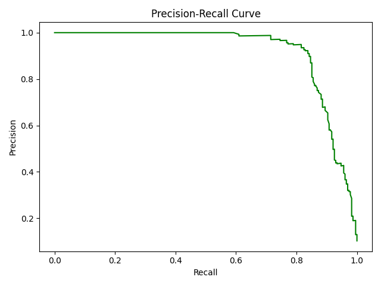
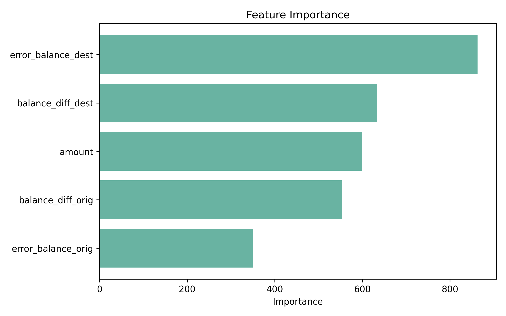

# 🚨 Fraud Detection System

A complete end-to-end ML pipeline to detect fraudulent transactions using engineered features, balanced training, and a deployed interface for predictions.

---

## 📌 Problem Statement

Financial fraud is a critical issue. The goal is to **identify fraudulent transactions** using transaction-level data and deploy a system that predicts fraud in real-time.

---

## 🧠 Solution Approach (Summary)

1. **Data Preprocessing**
2. **Exploratory Data Analysis (EDA)**
3. **Feature Engineering** (⚠️ Avoided label leakage)
4. **SMOTE for Class Balancing**
5. **Model Training (LightGBM & others)**
6. **Model Evaluation with Metrics & Curves**
7. **Model Deployment using Streamlit**
8. **Feature Importance Visualizations**

---

## 📊 Dataset Summary

| Class       | Count | Percentage |
|-------------|-------|------------|
| Non-Fraud   | 10000 | 89.75%     |
| Fraud       | 1142  | 10.25%     |

⚠️ **Highly imbalanced**, requiring SMOTE for better learning.

---

## 🧪 Feature Engineering

Dropped raw balance columns and created smart features to prevent leakage:

```python
balance_diff_orig   = oldbalanceOrg - newbalanceOrig
balance_diff_dest   = newbalanceDest - oldbalanceDest
error_balance_orig  = oldbalanceOrg - amount - newbalanceOrig
error_balance_dest  = oldbalanceDest + amount - newbalanceDest
```

✅ This logic is modularized in `utils.py` → `transform_features()`.

---

## ⚖️ Handling Class Imbalance

Used **SMOTE** (only on training data) to synthetically generate samples of the minority class (`isFraud = 1`).

✅ Prevents the model from overfitting on majority class.

---

## 🔍 Model Training

- Models tried: Logistic Regression, Random Forest, LightGBM ✅ (Best)
- Pipeline: `StandardScaler + LightGBM` using `Pipeline`
- Final model saved as: `fraud_detection_pipeline.pkl`

---

## ✅ Model Evaluation

### 📋 Classification Report

| Metric     | Non-Fraud | Fraud |
|------------|-----------|-------|
| Precision  | 0.98      | 0.92  |
| Recall     | 0.99      | 0.82  |
| F1-Score   | 0.99      | 0.87  |
| Accuracy   | 0.97 (overall) |

### 📌 Confusion Matrix



### 📈 ROC Curve



### 📉 Precision-Recall Curve



---

## 📦 Model Explainability

Feature importances (LightGBM):



---

## 🌐 Streamlit App

- 📁 File: `app.py`
- Loads pipeline using `joblib`
- Accepts user input: amount, balances, etc.
- Recomputes features → Predicts fraud

🎯 Live prediction, based on trained pipeline.

---

## 🛠 Folder Structure

```
.
├── Fraud_Analysis_Dataset.csv
├── app.py                      ← Streamlit app
├── train_model.ipynb           ← Model training pipeline
├── deploy_model.ipynb          ← Feature testing / sandbox
├── fraud_detection_pipeline.pkl← Trained model
├── utils.py                    ← Feature engineering logic
├── README.md                   ← You're here!
├── images/                     ← Images for plots
```

---

## 💡 Key Takeaways

- Avoided **label leakage** by engineering clean, logical features.
- Used **SMOTE** smartly to balance training.
- Achieved **~0.97 accuracy** with excellent recall using **LightGBM**.
- Built a **streamlit app** for real-time fraud prediction.
- Pipeline is **modular, explainable, and production-ready**.
