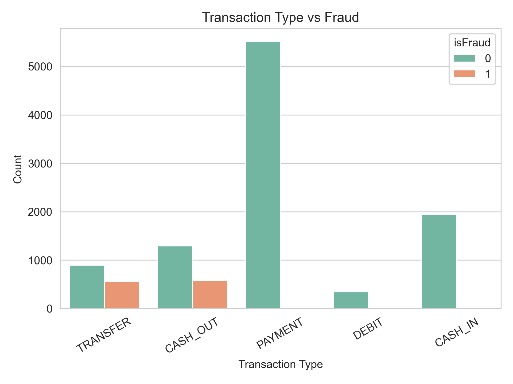

📊 Dataset Overview
This project utilizes a realistic simulation of mobile financial transactions to detect fraudulent behavior in digital payments. The dataset captures detailed transaction records typically seen in mobile money services, commonly used in regions with high financial inclusion via mobile platforms.

Each row in the dataset represents a single transaction with the following attributes:

step: Hourly time step from the start of the simulation.
type: Type of transaction (CASH-IN, CASH-OUT, TRANSFER, DEBIT, PAYMENT).
amount: The amount of money involved in the transaction.
nameOrig: Customer initiating the transaction.
oldbalanceOrg: Initial balance of the sender before the transaction.
newbalanceOrig: Balance of the sender after the transaction.
nameDest: Recipient of the transaction.
oldbalanceDest: Initial balance of the receiver before the transaction.
newbalanceDest: Balance of the receiver after the transaction.
isFraud: Target variable indicating whether the transaction was fraudulent (1) or genuine (0).

🔍 Objective:
Build a robust fraud detection system that can identify and flag suspicious financial activity in real time using machine learning, ultimately helping financial service providers reduce risk and protect users.

Transaction Types Distribution
Summary: Imbalanced, with PAYMENT and CASH_IN dominating.

Fraud by Transaction Type
Summary: Fraud occurs only in TRANSFER and CASH_OUT, so type may leak info.

Numerical Feature Distributions
Summary: Skewed distributions and outliers are natural, so avoid aggressive cleaning.

Correlation Matrix
Summary: Strong correlation (0.83) between step and fraud.

Step Bins vs Fraud
Summary: Fraud spikes from step 11 onwards; model bias caution needed.

